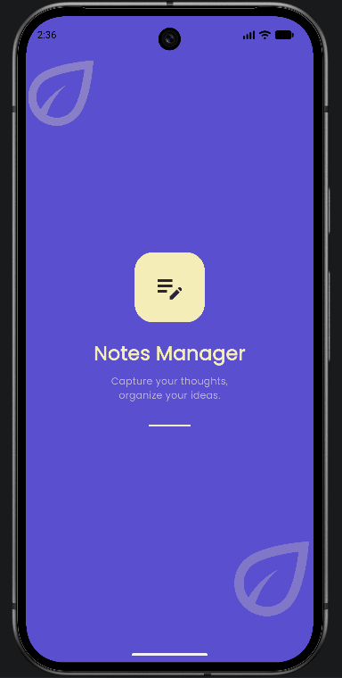
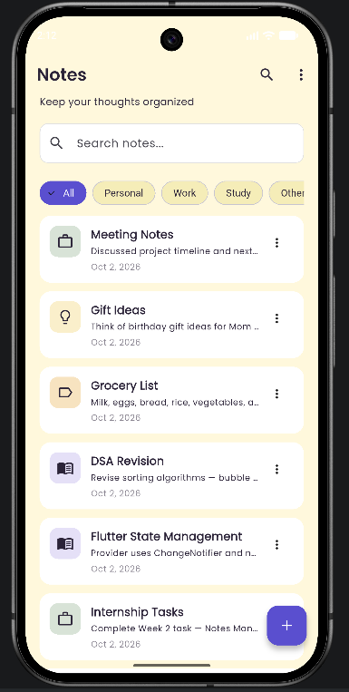
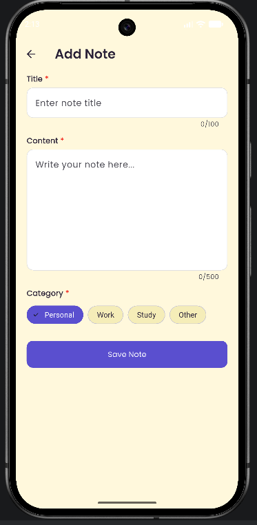
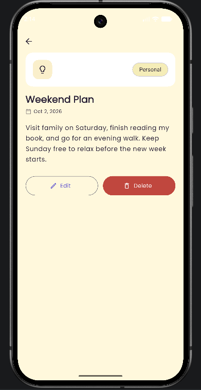
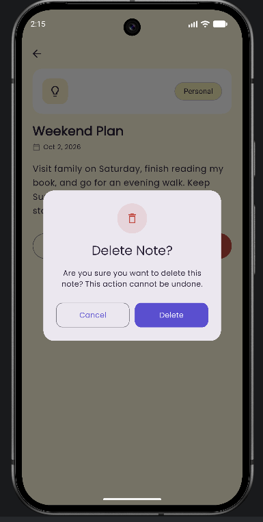
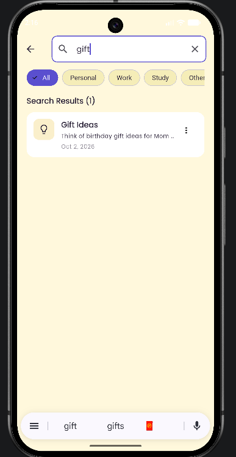

# Notes Manager

A Flutter Notes app built for the Week 2 internship task — **State Management,
Forms & Local Storage** — at DawoodTech NextGen.

**Live Demo:** https://noorfatima-0319.github.io/notes_manager/
**GitHub Repository:** https://github.com/noorfatima-0319/notes_manager

## Objective

This app demonstrates state management with Provider, form validation, local
data persistence, and full CRUD (create, read, update, delete) operations on
a dynamic, searchable, filterable list.

## Features

- Create, edit, delete, search and filter notes by category
  (Personal, Work, Study, Other)
- Form validation (required fields, minimum length, character counters)
- Notes persist locally using `shared_preferences`, so they remain after
  closing the app
- Sort notes by Newest, Oldest or Title (A-Z)
- Dedicated search screen with its own text search and category filters
- Empty states and a delete confirmation dialog
- Dark mode toggle (saved locally)
- Responsive layout with reusable widgets

## Concepts Applied

- **State management:** a `NotesProvider` (`ChangeNotifier`) holds the notes
  list, category filter, sort order and theme, and notifies the UI to
  rebuild automatically
- **Forms & validation:** `Form`, `TextFormField`, `GlobalKey<FormState>`,
  and `validator` functions for title/content rules
- **Local storage:** notes are serialized to JSON and saved with
  `shared_preferences`
- **CRUD operations:** add, edit, delete and read notes, all persisted
- **Dynamic lists with search:** `ListView.builder`/`separated` combined
  with live filtering by text and category

## Project Structure

```
lib/
├── main.dart
├── constants/
│   └── app_constants.dart
├── models/
│   └── note_model.dart
├── providers/
│   └── notes_provider.dart
├── services/
│   └── notes_storage_service.dart   # SharedPreferences read/write
├── screens/
│   ├── splash_screen.dart
│   ├── notes_list_screen.dart       # Home: list, category chips, FAB
│   ├── note_form_screen.dart        # used for both Add and Edit
│   ├── note_detail_screen.dart
│   └── search_screen.dart           # dedicated search + filter screen
├── theme/
│   └── app_theme.dart
└── widgets/
    ├── note_card.dart
    ├── category_chips.dart
    ├── empty_state.dart
    └── confirm_dialog.dart
```

## Screenshots

| Splash | Home | Add Note |
|--------|------|----------|
|  |  |  |

| Note Detail | Delete Confirmation | Search |
|-------------|----------------------|--------|
|  |  |  |

## Technologies Used

- Flutter & Dart
- `provider` — state management
- `shared_preferences` — local storage
- `intl` — date formatting
- `google_fonts` — typography

## Setup Instructions

1. Clone the repository:
   ```bash
   git clone <your-repo-url>
   cd notes_manager
   ```
2. Install dependencies:
   ```bash
   flutter pub get
   ```
3. Run the app:
   ```bash
   flutter run
   ```

## Building for Web (live demo)

```bash
flutter build web --release --base-href "/notes_manager/"
```
Copy the contents of `build/web` into a `docs` folder and enable GitHub
Pages on the `main` branch, `/docs` folder.

Note: `shared_preferences` stores data in the browser's local storage on
web, so notes created in the live demo stay in that browser only.

## Author

**Noor Fatima**
BS Information Technology, Government College University Faisalabad
